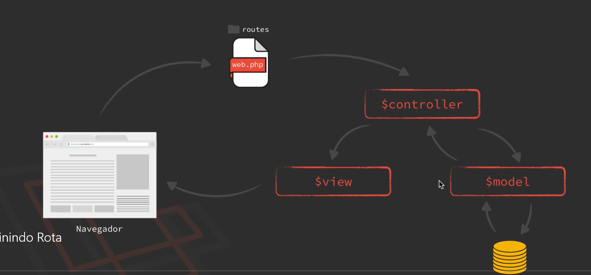

### 3. Primeiro contato
1. Primeiro Contato
    - Fluxo MVC
     
    - ***View:*** _A camada de visão é responsável por apresentar os dados processados pelo Controller/Model. O laravel utiliza o blade que é um motor de templates (templating engine) que possibilita criar views, com  templades simmples ou complexos contando com componentes que podem ser herdados e usados em várias views, sem o uso de PHP plano. Por padrão as views ficam dentro da pasta ***resources/views/exemplo.blade.php*** e são invocadas pelas rotas definidas em ***/routes/web.php*** como no exemplo abaixo:_
    ```php
        //Obs. no segundo parâmetro é definida uma closure que retorna a view sem obrigatoriamente informar a extensão '.blade.php' 
        Route::get('NomeDaRotaWeb',function(){
            return view('NomeDaVisaoSemExtesao');
        });
    ```  
    - ***Controller:*** _A camada de controle é uma classe que faz a ponte entre a ***Visão*** e o ***Modelo***. Para isso ao definir uma rota, no segundo parâmetro deve ser informado o nome do controller como no exemplo abaixo:_
    ```php
        Route::get('NomeDaRota',NomeDoController@metodoDoController);
    ```  
    - ***Model:*** _Na camada de modelo é onde implementa a comunicação com o banco de dados:_
    ```php
            class modelName extends Model
            {   
                //campos da tabela no banco que fará o CREATE, READ, UPDATE 
                protected $fillable = ['id','campo1','campo2'...]
            }
    ```  
2. Definindo Rota
    > Como vemos no tópico acima, no laravel podemos definir rotas para view usando o motor de templetes do laravel(blade), ou podemos também criar uma API para se comunicar com um frontend desenvolvido fora do laravel. As rotas de API devem ser implementadas no arquivo ***/routes/api.php*** e para serem consumidas pelo cliente http deve-se acrescentar /api no final da url ficando então http://dominio/***api***/nomedarota
	- 1 Cadastro de um Imóvel
        ```
	- 2 Single e Listagem
3. 1Adicionando URL amigável
4. 1Edição do Imóvel
5. 1Remoção de registros
6. Adicionando camada Model
7. Método create e save
8. Estruturando view master
9. 1Formatando páginasre